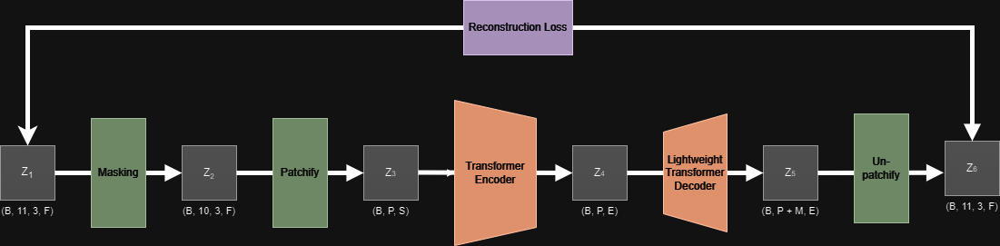

# TrackingMAE

# NBA Player Tracking Transformer Pretraining

## Overview

This project focuses on pretraining a Transformer encoder model on NBA player tracking data. The architecture and methodology are inspired by the paper [Masked Autoencoders Are Scalable Vision Learners](https://arxiv.org/abs/2111.06377), which explores masked autoencoders for scalable vision learning.

The goal is to adapt the principles from the vision domain to the realm of sports analytics, particularly focusing on NBA player tracking data. The Transformer model will be pretrained to capture patterns and dynamics in player movement, which can be leveraged for various downstream tasks such as player behavior prediction, game strategy analysis, and more. The unsupervised nature of the pretraining stage will allow for a significant amount of data to be leveraged.

## Model Architecture

The model is designed to learn useful representations of player tracking data using a Transformer encoder. The core idea is to mask portions of the tracking data and train the model to predict the masked data, a technique inspired by the masked autoencoder approach.

### Diagram of the Model

Below is a high-level diagram of the model architecture:

In this diagram:
- **Input Data**: NBA player + ball tracking data (x, y, z)
- **Masking**: Masking of a single entity throughout the tracking sequence (multiple entity masking used in later pretraining stages)
- **Patching**: Conversion of tracking data in 'patches', containing a single entities tracking data for a subset of the input sequence
- **Reconstruction Loss**: The model is trained to accurately recreate the input sequence
