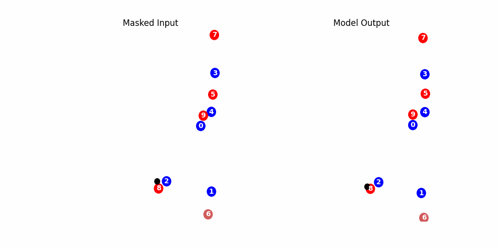
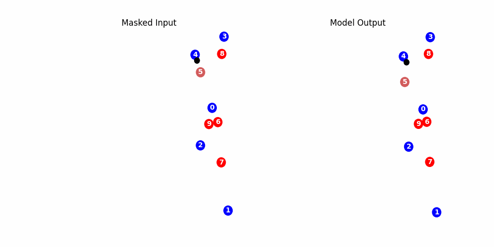
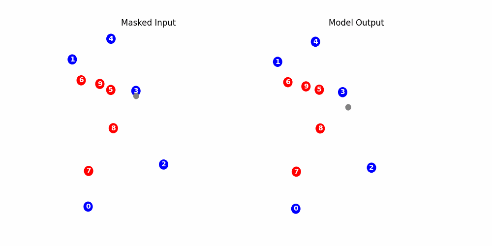

# TrackingMAE

# NBA Player Tracking Transformer Pretraining

## Overview

This project focuses on pretraining a Transformer encoder model on NBA player tracking data. The architecture and methodology are inspired by the paper [Masked Autoencoders Are Scalable Vision Learners](https://arxiv.org/abs/2111.06377), which explores masked autoencoders for scalable vision learning.

The goal is to adapt the principles from the vision domain to the realm of sports analytics, particularly focusing on NBA player tracking data. The Transformer model will be pretrained to capture patterns and dynamics in player movement, which can be leveraged for various downstream tasks such as player behavior prediction, game strategy analysis, and more. The unsupervised nature of the pretraining stage will allow for a significant amount of data to be leveraged.

## Model Architecture

The model is designed to learn useful representations of player tracking data using a Transformer encoder. The core idea is to mask portions of the tracking data and train the model to predict the masked data, a technique inspired by the masked autoencoder approach.

### Diagram of the Model

Below is a high-level diagram of the model architecture:

In this diagram:
- **Input Data**: NBA player + ball tracking data (x, y, z)
- **Masking**: Masking of a single entity throughout the tracking sequence (multiple entity masking used in later pretraining stages)
- **Patching**: Conversion of tracking data in 'patches', containing a single entities tracking data for a subset of the input sequence
- **Reconstruction Loss**: The model is trained to accurately recreate the input sequence

## Results
### Unsupervised Pre-Training

Below are examples from the pre-training stage. The player (or ball) that was masked is shaded lighter.

Here, you can see the model has likely learned the dynamics of a screen, as once player 8 approaches player 6 (or the area the masked player 6 is likely occupying) the model predicts player 6 to motion off of the screen. Additionally, the model seems to understand defensive spacing, as it quite accurately predicts the entirety of player 6's cut across the baseline, most likely driven by player 2's positioning.

Interestingly, the model predicts better performance from player 5. On the drive by player 4, it predicts much quicker reaction time than player 5 actually had. Additionally, once the possession changes it predicts that player 5 runs down the court much earlier than they actually did. This shows that the model is able to capture expected performance from an *average* NBA player - this will be quite useful in downstream tasks.

With the ball masked, the model doesn't quite get there.

## Next Steps
Fine tune a 'points on possession' model to enhance the model's understanding of the game. This will also unlock a few additional downstream tasks such as [Player2Vec](https://github.com/jacksonlewis87/Player2Vec).
